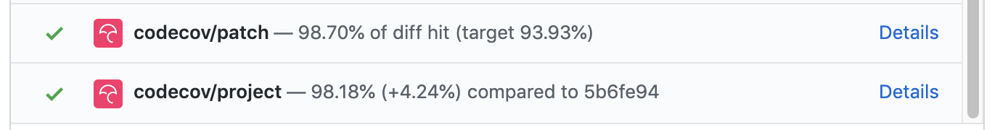
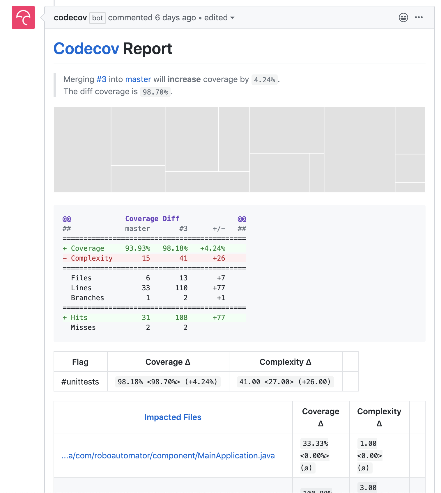

# CodeCov with GitHub Actions

**Branch:** [with_codecov](https://github.com/fishey2/java-component-template/tree/with_codecov) 

[CodeCov](https://codecov.io/gh/fishey2/java-component-template) is a code coverage reporting tool, which can process 
most coverage reports and provide the use with useful information, such as "Complexity Coverage" and "Code Coverage"  

One of the main benefits is its integration into pipelines, where it can analyse, act as a quality gate and
comment with analysis on pull-requests.

This would benefit people doing GitFlow-based development, people using Trunk-based development will not find 
any additional benefit over common static analysis tools (such as [SonarCloud.io](https://sonarcloud.io/projects)).

Example result on a pull-request after analysis



It will also add a detailed report to the pull-request.



## Configuring (Action)

CodeCov provides an Action for GitHub workflows ([codecov/codecov-action](https://github.com/codecov/codecov-action)). 

For the integration I am using JUnit5 and [Jacoco](https://www.eclemma.org/jacoco/) for generating code coverage 
metrics and reports. 

In gradle, [Jacoco](https://www.eclemma.org/jacoco/) can be configured to output an XML report for CodeCov to consume 
by adding the following config:

```groovy
// Outputs to build/reports/jacoco/test/jacocoTestReport.xml
jacocoTestReport {
    reports {
        xml.enabled true
        html.enabled false // Default is true
    }
}
```
Then the following snippet can be used in GitHub workflows to perform the CodeCov analysis.

```yaml
- name: Upload coverage to Codecov
        uses: codecov/codecov-action@v1
        with:
          token: ${{ secrets.CODECOV_TOKEN }}
          file: ./build/reports/jacoco/test/jacocoTestReport.xml
          flags: unittests
          name: codecov-umbrella
```

The `CODECOV_TOKEN` needs to be set in GitHub Secrets when linking the project.
      
## Badge Example

Badges are a quick single information piece that can be used to get a feel for quality/status of
a project.

CodeCov has it's own dynamic badge, which changes shade depending on how well covered the code is.

[](https://codecov.io/gh/fishey2/java-component-template)

The above badge can be done using the example:

```markdown
[](https://codecov.io/gh/fishey2/java-component-template)
```

## Multi-level Testing

Most projects have both Unit/Integration tests, which exercise different portions of
the code base. By default, the different jacoco contexts will output to the same folder,
when you go to generate the report using jacocoTestReport, it will use all `.exec` files in the folder.

To ensure data from both unit and integration tests were includes, I depended on both:

```groovy
jacocoTestReport.dependsOn test
jacocoTestReport.dependsOn testIntegration
```


