# SonarCloud Setup

Setting-up SonarCloud is quite simple, you can click on the integration of your choice and
follow the flow through to integrate.

[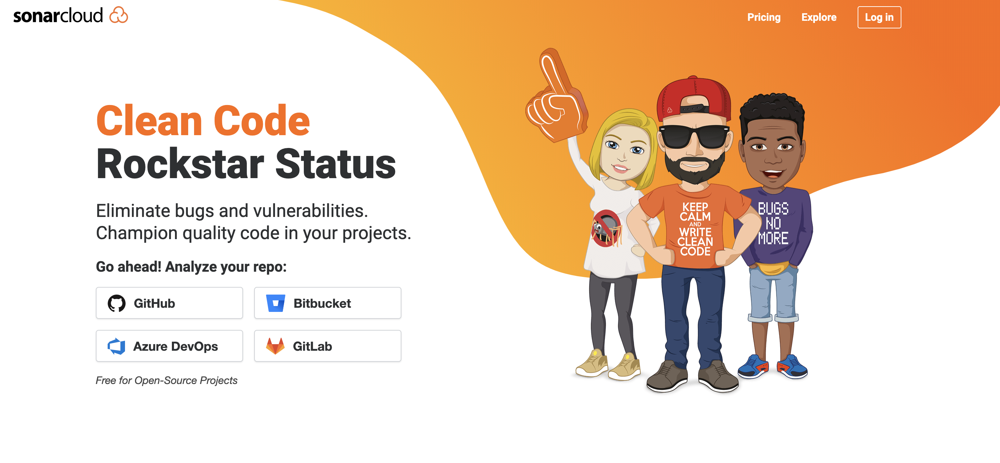](https://sonarcloud.io/)

Once you have done that, and you are ready to add a project.

Clicked on GitHub

[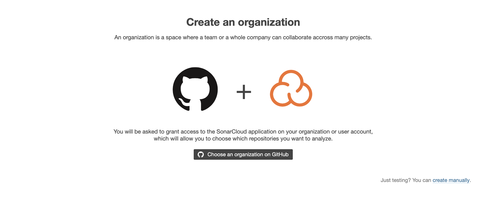](https://sonarcloud.io/)

Clicked on Choose an organization on GitHub

Clicked on com-roboautomator

[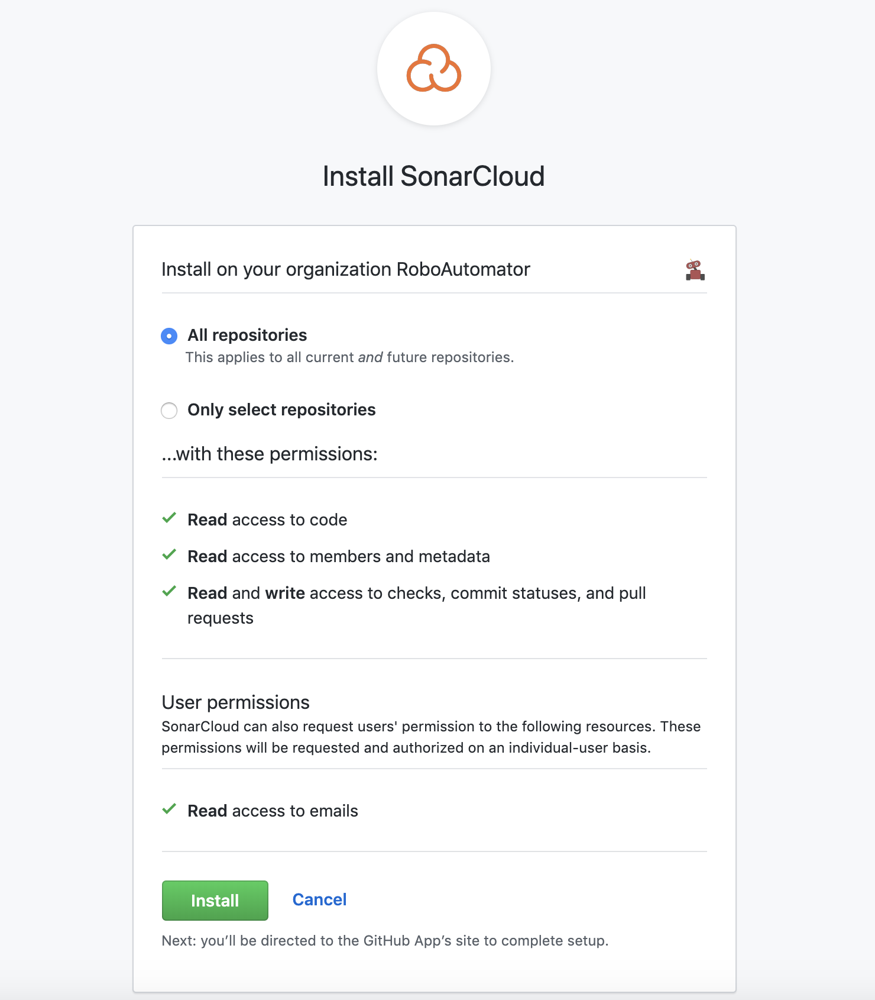](https://sonarcloud.io/)

Instead of selecting all, I selected Only select repositories

[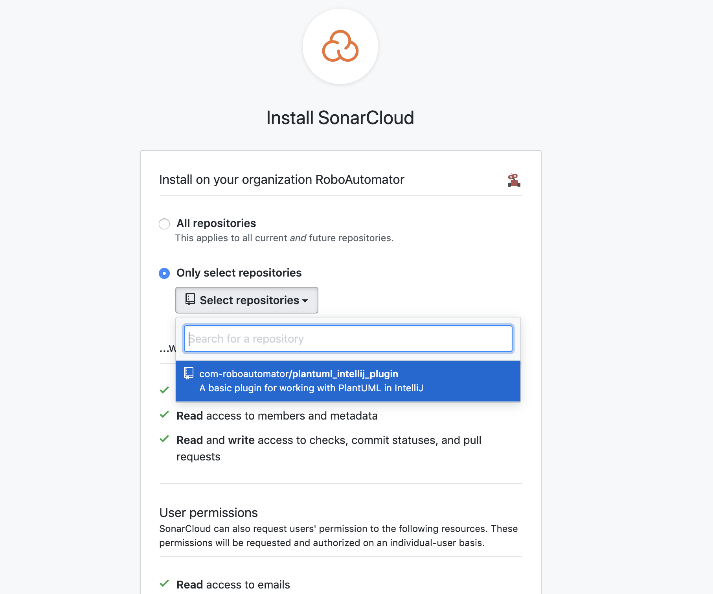](https://sonarcloud.io/)

Then I selected the `plantuml_intellij_plugin` project

[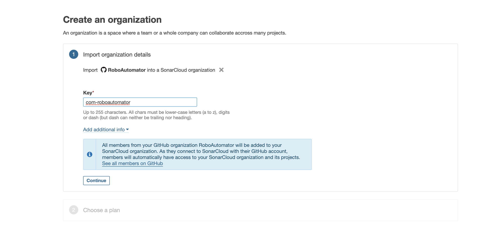](https://sonarcloud.io/)

Then I clicked on continue

[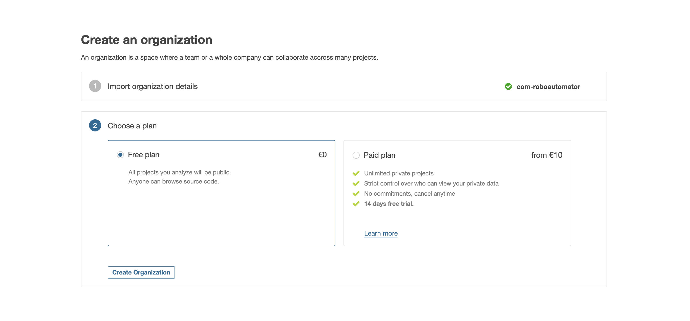](https://sonarcloud.io/)

Then Click Crete Organization

[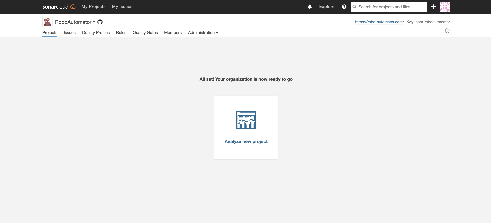](https://sonarcloud.io/)

Then Clicked analyse new project

[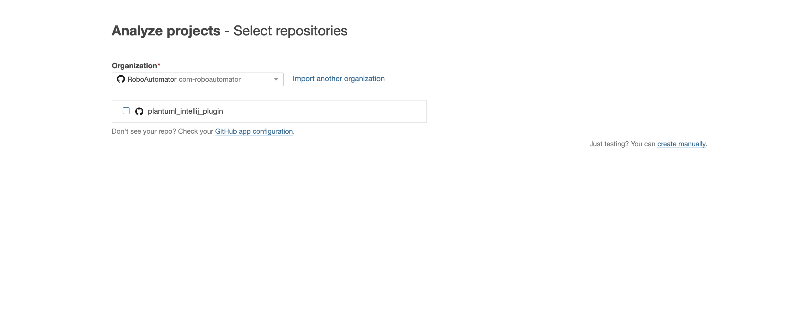](https://sonarcloud.io/)

Clicked `plantuml-intellij-plugin`

Click Set Up

[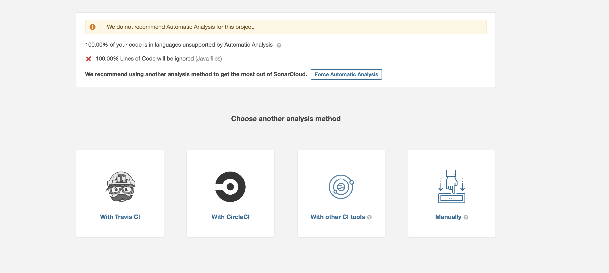](https://sonarcloud.io/)

Clicked Manually 

[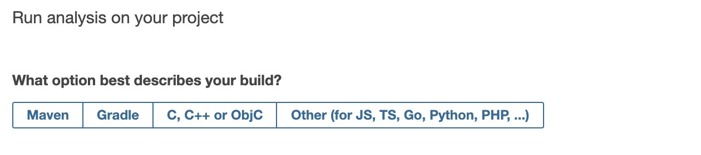](https://sonarcloud.io/)

Clicked Gradle

[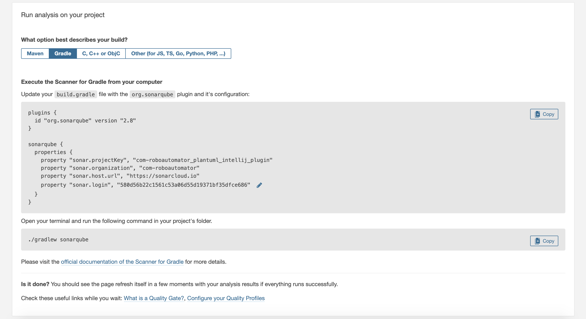](https://sonarcloud.io/)

__________

[<------ BACK](./index.md) | [HOME](../index.md) | [NEXT ------>](./GradleSetup.md)

